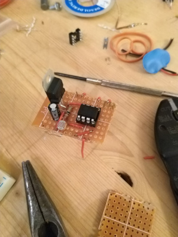
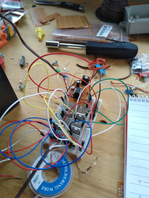
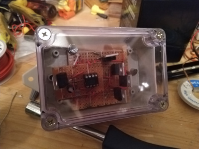

# Automated Chicken Coop Door

This project uses a ATtiny 85 to open and close a chicken coop door at sunrise and sunset.

Rather than calibrating a light sensor I approached this with an adaptive strategy, where the microcontroller "learns" the distribution of nighttime and daytime sensor values.

I ended up using a custom K-means approach to cluster values into two bins.

# Setup

The included `Makefile` can be used to compile the `main.c` file. Use your favorite method to flash the device.

# Build Pics

I only have some build pics, the device did work as intended, but my soldering skills + cheap voltage controller made for a short lived device.

